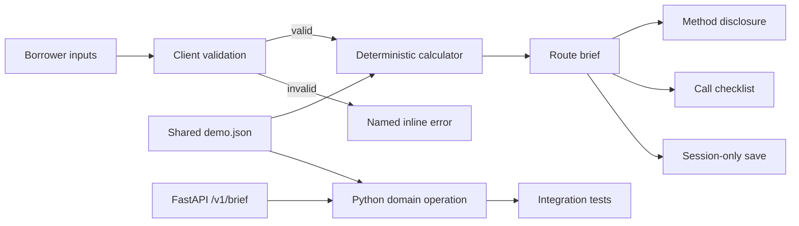
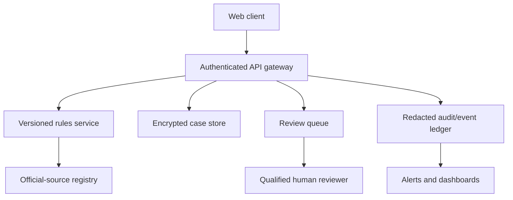

# Architecture

## Prototype flow

GitHub Pages serves only the static Next.js export. The UI performs the same deterministic operation locally so the deployed demo remains interactive. FastAPI is runnable and tested source, not a live backend.

## Boundaries

- `app/page.tsx`: input state, validation, interaction states, and client calculation.
- `data/demo.json`: explicit fictional borrower fixtures, educational parameters, and checklist copy shared by both stacks.
- `api/main.py`: typed server contract and actual amortization/domain operation.
- `tests/`: browser behavior, invalid input, session save, and mobile overflow.
- `api/tests/`: happy path, zero-rate path, missing/invalid input, and health check.

## Production trajectory

Every calculation response should carry `policy_version`, `effective_at`, formula inputs, source citations, and a human-readable scope statement. Rule versions are immutable; corrections create new versions. A kill switch disables stale calculations without blocking access to saved evidence.

## Failure semantics

- Empty/invalid input → local `InputValidationError`; no calculation; actionable alert.
- Unsupported/outdated rule → production `PolicyUnavailableError`; show official links and stop estimates.
- Upstream timeout → `OfficialSourceTimeout`; preserve the draft and offer retry, never substitute uncited rules.
- Save failure → `CaseSaveError`; keep the brief visible and offer export.
- Extraction uncertainty → `NoticeExtractionUncertain`; highlight fields for confirmation before calculation.

## Security and privacy

No authentication, persistence, or document upload exists in this demo. Production requires field-level encryption, minimal retention, redacted telemetry, dependency scanning, rate limiting, CSRF protection, authorization tests, and a documented data-deletion path. Never log AGI, balance, notice content, or identifiers.
